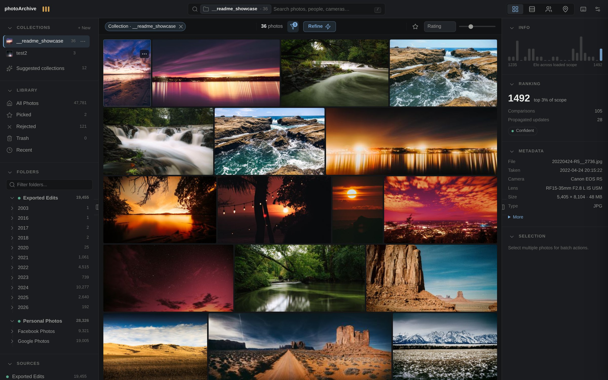
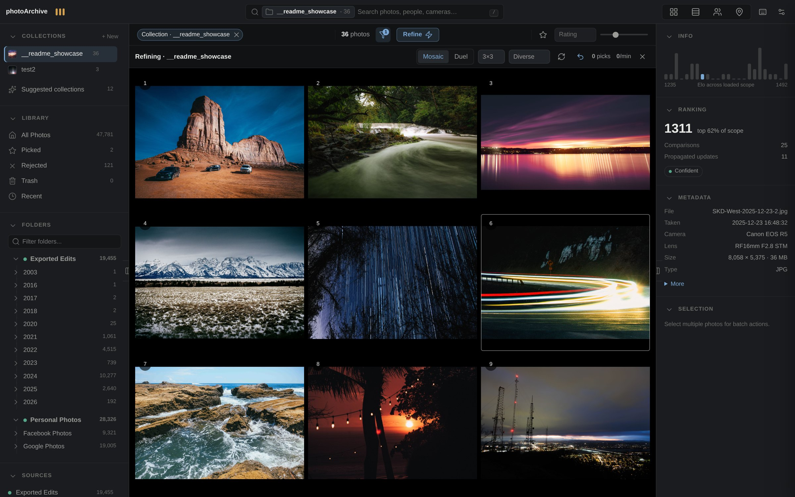
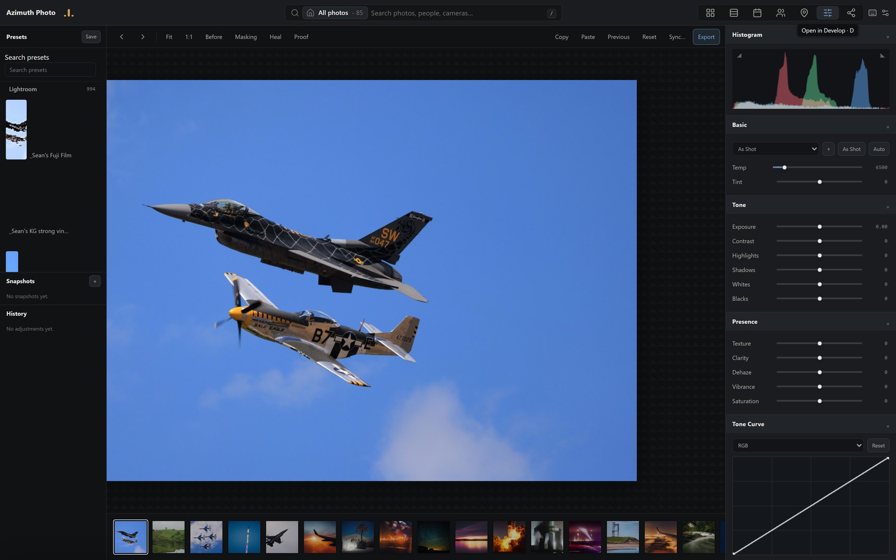
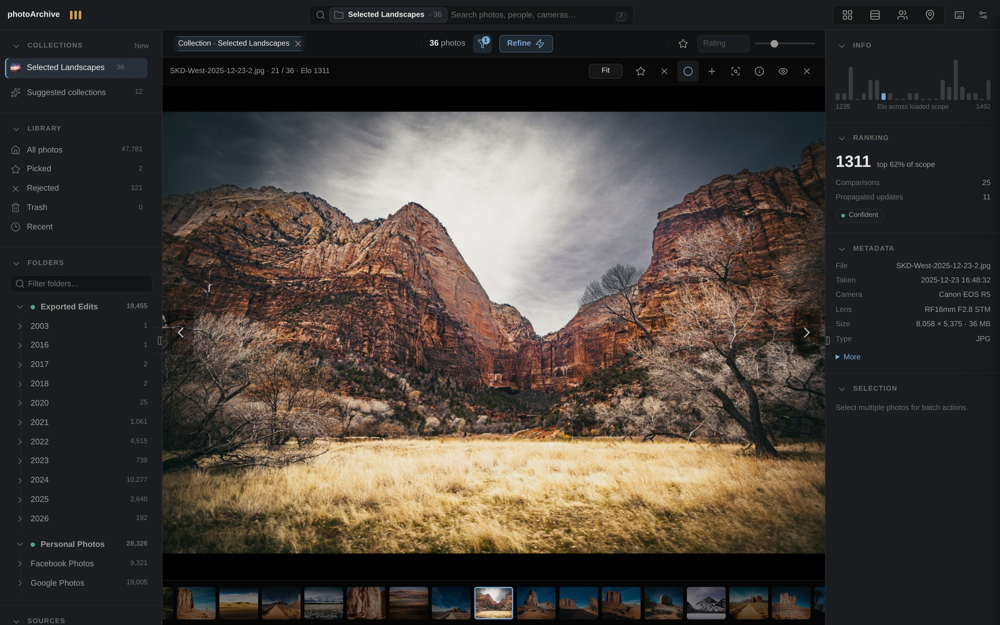
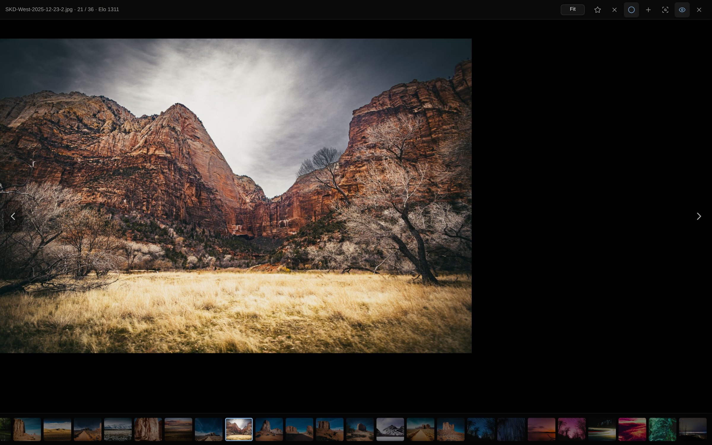

# Azimuth Photo

**Your archive, on your hardware — with Lightroom Classic instincts.**

[](https://github.com/Sean-Kenneth-Doherty/azimuth-photo/actions/workflows/ci.yml)
[](LICENSE)
[](docs/CORE.md)

Azimuth is a photo library for people with too many photographs. It browses
terabytes from a sleepy USB drive without flinching, ranks your archive by
asking *this one or that one?*, and opens any frame in a real non-destructive
darkroom — all on your own machine, with nothing uploaded anywhere.

> **▶ Try it live, no install — [azimuthphoto.com](https://azimuthphoto.com)**
> Not screenshots. The real library grid, the keyboard loupe, the Elo Refine
> mosaic and the fused search engine, running in your browser on real catalog data.
>
> **📖 Why it looks like this — [the Field Log](https://azimuthphoto.com/log/)**
> The honest build history across 2,304 commits, with interactive demos: the
> film engine's halation, the GL↔NumPy twin, and the month we deleted 42% of
> the codebase.



---

## Azimuth 2.0 — smaller on purpose

Azimuth grew to **182,688 lines**, and it had two problems that more code was
not fixing: a quarter of every commit was repair-shaped, and simple changes took
days. So in August 2026 it was measured, gutted, and rebuilt on a core small
enough to hold in your head.

The measurement that settled it: the live catalog was 2.4 GB across 84 tables —
**41 of them empty** — and of every row in it, the part that could never be
recomputed (your keeps, stars, edits and names) was **0.06%**. Everything else
was a machine's opinion about bytes it could read again.

So the machine's opinions were deleted, and the app got faster:

| | before | after | |
|---|---|---|---|
| Grid page | 180 ms | **0.22 ms** | 86 indexes on one table became 5 |
| Semantic search | 19,538 ms | **50 ms** | vectors keyed on content hashes |
| Status counts | 188 ms | **8.3 ms** | computed, not stored |
| The codebase | 182,688 lines | **105,632** | and still descending |

Not because anything was written tersely — the core is heavily commented — but
because most of what was there had **stopped being asked**. Five separate
subsystems for recovering a moved file didn't get fixed; they stopped having a
reason to exist once a path was stored as *a drive plus a tail*.

The whole design is one document: **[docs/CORE.md](docs/CORE.md)** — four facts,
five tables, seven functions. The reasoning, with the mistakes left in, is
[Act II of the Field Log](https://azimuthphoto.com/log/#act2).

---

## Ranking, not rating



You cannot honestly star-rate ten thousand photos. But you can always answer
*this one, or that one?*

**Refine** shows a mosaic — pick the best one. The winner is replaced by a fresh
contender; the rest stay and keep competing. Behind it is an Elo system with
uncertainty tracking and propagation through visually similar photos, so one
pick moves the frames that look like it. A quality meter tells you how *sorted*
any scope actually is.

Rank an entire archive, one two-second decision at a time. It's the oldest idea
in the project — the 2023 version was 228 lines of Tkinter — and the only one
that never changed.

## A darkroom, not just a manager



Press **D** and any photo opens in a full non-destructive **Develop** module: a
live WebGL2 editor with Lightroom-ordered panels — white balance, tone,
presence, an interactive tone curve, HSL, masking (brush / linear / radial /
luminance / colour-range), heal, crop, and history.

- **Its own RAW pipeline.** DNG colour science pixel-matched to Lightroom, and a
  decoder for the lossy JPEG-XL DNGs LibRaw cannot open — a 2048px base in 0.4 s.
- **The twin.** Every edit runs *twice* — a WebGL shader for the live preview, a
  NumPy pipeline for export — pinned to a shared constants table so they stay
  identical to within **0.4 of 255** on every pixel. What you see is exactly
  what you export.
- **A physically-modeled film engine.** Not a LUT. It models the photochemistry:
  spectral layer exposure, halation, H&D characteristic curves, DIR couplers,
  per-layer grain. Eight stocks tuned against **53 real lab scans** — the
  CineStill 800T glow *emerges* from the physics rather than being painted on.
  [Play with the halation model →](https://azimuthphoto.com/log/#ch-darkroom)

## The library

A virtualized grid that stays smooth at 50,000 photos. A real folder tree with
per-folder counts and instant scoping. Filter by camera, lens, file type, flag,
rating floor or date — every facet composes. A timeline scrubber rides the right
edge on date-sorted views, and zero-result scopes tell you *why* and offer the fix.

**Stacks** group what belongs together, LR-Classic style — burst sequences,
export variants of one edit, and cross-source duplicates (that re-uploaded copy
of your original) collapse behind a single cover with a count badge.

**Trash is safe by design.** Deleting moves files to a `.trash` area on the same
drive — fully restorable, byte-identical, ratings and history intact. Nothing is
permanently removed until you empty it yourself. The machine never deletes your
last copy; only you do.

## The loupe



A full canvas view, not a modal — metadata, ranking and a live histogram stay
beside the image. Zoom to 100% with Space, flag with P/X/U, cycle the info
overlay with I, and press **L** for lights-out when it's just you and the
photograph.



## Search

Two engines answer every query and their results are fused: **metadata**
(filenames, folders, cameras, lenses, dates via trigram FTS) and **semantic
embeddings**, so "night sky over trees" finds the frame you meant. The omnibox
shows live results, facet completions (`camera:`, `lens:`, `folder:`…) and
natural date parsing as you type.

Everything runs locally against vectors stored in your own catalog — nothing is
sent anywhere, and search answers whether or not a model is loaded.

## Built for speed

- **A tiered preview cache** (small / medium / large / originals) with size
  budgets, pre-generated in the background so browsing never waits on a slow
  external drive.
- **A virtualized grid** keeps the DOM tiny no matter how deep you scroll —
  50,000 photos feel like 50.
- **Work is a query, not a queue.** Everything computed — tiles, embeddings,
  metadata — is found by a single anti-join of what exists against what's owed.
  A worker that dies leaves nothing to expire.

Point it at terabytes on a sleepy USB drive and it still feels instant; the
archive wakes the drive only when it truly needs original pixels.

## Architecture

Azimuth 2.0 is **a desktop application, not a server**: one Python process
opens a native window on one bundled document. No port, no auth layer, no
session machinery, and no attack surface to harden. Nothing outward can reach
it.

Azimuth knows exactly four things about a photograph: **what it is** (its bytes),
**where copies are**, **what you decided**, and **what we computed**. Only your
decisions are irreplaceable, so they live in an append-only log; everything else
can be rebuilt from the photographs themselves.

```
model     five tables, seven functions            imports nothing of the product
pixels    the colour mathematics                  pure functions over arrays
work      one query, one worker: everything computed gets made here
surfaces  queries over the facts, plus the decisions they write
boot      the one product boundary; desktop puts it in a window
ui        kit <- net <- store <- lens <- shell, bundled into the document
```

- **Catalog**: SQLite (WAL), on the laptop, never on a share.
- **Window**: pywebview over WebView2; the UI is plain ES modules and CSS, no
  framework, one esbuild step.
- **Local-first**: the home folder holds the catalog and the previews, like a
  Lightroom catalog; an archive drive being unplugged is a normal state.

Full design, with the reasoning and the mistakes: **[docs/CORE.md](docs/CORE.md)**.
The code shape and its gates: [docs/ARCHITECTURE.md](docs/ARCHITECTURE.md).
Every code file and the evidence that proved it: [docs/REWRITE_LEDGER.md](docs/REWRITE_LEDGER.md).

## What 2.0 does not have yet

The rewrite deleted machinery faster than it rebuilt surfaces. These worked in
v1 and are not in 2.0 today:

- **Sharing and client galleries**: four overlapping systems for handing
  someone a photo; to be rebuilt as one.
- **Hub / satellite sync**: the laptop and its drive are the system now. A
  share is a drive; a helper is another machine doing owed work.
- **VLM captions**: the derivation fleet was removed. People, faces and a
  learned label vocabulary are back, on the laptop's own CPU and card.
- **The phone**: parked until the desktop is finished.

If you need those today, the last full v1 build is commit
[`d8aa7b8f`](https://github.com/Sean-Kenneth-Doherty/azimuth-photo/commit/d8aa7b8f),
immediately before the first deletion wave. Saying this out loud is cheaper than
letting you discover it after an import.

## Quickstart

Windows, Python 3.12, Node 22:

```powershell
git clone https://github.com/Sean-Kenneth-Doherty/azimuth-photo.git
cd azimuth-photo
python -m venv web\.venv
web\.venv\Scripts\python.exe -m pip install -r web
equirements-v2.txt
npm ci
.\scripts\start_azimuth_windows.ps1
```

It asks where it should live, then for a folder of photographs, and the
library fills while you watch. Semantic search, Best and labels sharpen as the
embedding space grows; everything else works from the first tile.

[Install](docs/INSTALL.md) covers the frozen build; [Getting started](docs/getting-started.md)
covers the first library.

## Docs

- [**docs/CORE.md**](docs/CORE.md) — the 2.0 design. Start here.
- [**The Field Log**](https://azimuthphoto.com/log/) — the build story, 2,304 commits, with live demos
- [Documentation index](docs/README.md) · [Features in depth](docs/features.md)
- [Development guide](docs/development.md) · [Agent guide](AGENTS.md)
- [Data & privacy](docs/data-and-privacy.md)

---

*Azimuth is developed against the author's own 150,000-photo working archive —
every screenshot above is that real library, on one machine. Your photos are
your own; the app ships empty and hungry.*
