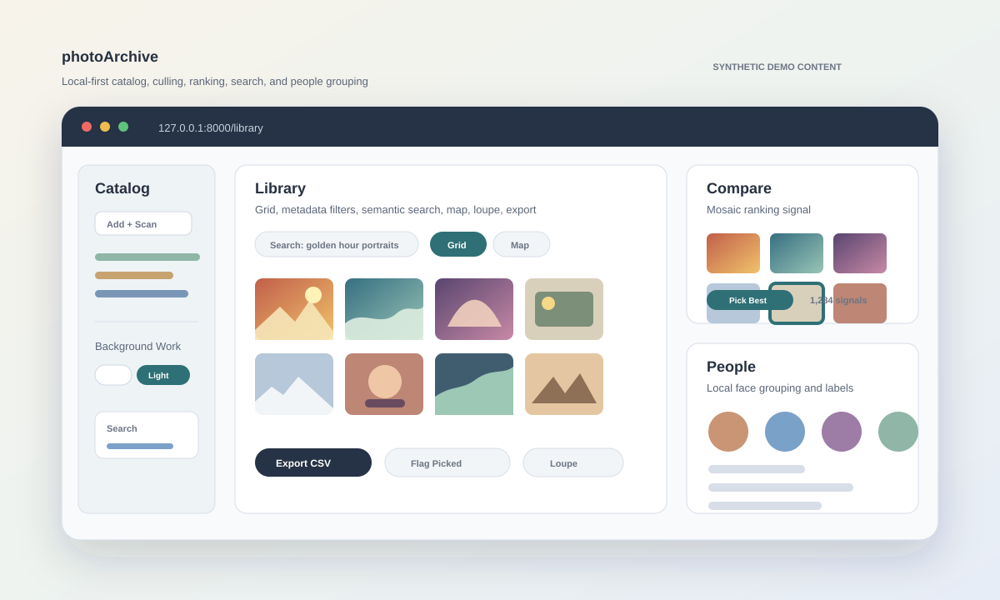

# photoArchive

photoArchive is a local-first photo library for large personal archives: external
drives, RAW files, years of exports, slow storage, and the need to browse, rank,
search, and organize without uploading the archive anywhere.

The app runs on your machine. It indexes source folders, stores its own catalog
and caches, and never edits or deletes your original photo files.
If a removable drive is slow to wake or temporarily offline, cached Library,
Compare, search, and People views remain available; rescans simply wait until
the source folder is reachable again.



The preview above is synthetic demo artwork for the repo. It does not contain
private photos, real archive paths, or personal metadata.

## What It Does

- **Catalog** source folders, rescan them, tune cache settings, and manage local
  AI model status from one setup screen.
- **Browse** a fast Library grid or map, filter by metadata, open a full-screen
  loupe, flag picks/rejects, and export filtered results.
- **Rank** photos with Compare modes built for quick culling: Mosaic, Swiss A/B,
  and Top 50.
- **Find** images with metadata search, optional local semantic search,
  similarity lookup, and duplicate discovery.
- **Group people** with local face detection, labels, merge suggestions, and
  Library/Compare person filters.
- **Take it mobile** with an installable phone app at `/m`: a fast timeline of
  the whole archive, search, one-thumb ranking, and collections — served from
  your own machine, no cloud.

Supported scanned file types are `.jpg`, `.jpeg`, `.png`, `.dng`, `.cr3`,
`.tif`, `.tiff`, and `.webp`.

## Requirements

- Python 3.11+
- Linux, currently the primary target
- Enough local disk for the SQLite catalog, thumbnails, optional original-image
  cache copies, and optional AI models
- An NVIDIA GPU is strongly recommended for semantic search and large
  embedding runs
- Internet access for first-time Hugging Face model downloads, unless models are
  already present locally

The app can still catalog, browse, compare, flag, and export images without AI
models installed.

## Quickstart

```bash
git clone https://github.com/Sean-Kenneth-Doherty/photo-archive.git
cd photo-archive/web
python -m venv .venv
source .venv/bin/activate
pip install -r requirements.txt
cd ..
./scripts/photoarchive-server start
```

Open `http://127.0.0.1:8000`.

Useful server commands:

```bash
./scripts/photoarchive-server status
./scripts/photoarchive-server logs
./scripts/photoarchive-server restart
./scripts/photoarchive-server stop
```

You can also run FastAPI directly:

```bash
cd web
.venv/bin/uvicorn app:app --host 127.0.0.1 --port 8000
```

## First Run

1. Open the app. The root page opens Catalog, the setup and control surface.
2. In **Catalog Sources**, choose a folder or use tree browse, then select
   **Add + Scan**.
3. Use the small help dots and hover tips when a control is unfamiliar; they are
   placed beside setup, cache, AI, People, filters, and Compare controls.
4. Use the **Background Work** panel when you want to start or stop **Search**,
   **Previews**, or **People**. Nearby-image warming stays on automatically
   while you browse.
5. Go to **Library** once photos appear.
6. Use **Compare** when you want the app to learn which images are better.
7. Install the local AI model from Catalog when you want semantic search.

## Mobile App

Open `/m` on your phone for the installable mobile app: a timeline of the
whole archive, search, one-thumb ranking, and collections, all writing to the
same local catalog. Installing it as an app (with offline support) requires
HTTPS; on a Tailscale network one command provides that with a real
certificate:

```bash
tailscale serve --bg --https=8443 http://127.0.0.1:8000
```

Then install from `https://<machine>.<tailnet>.ts.net:8443/m`.

## Documentation

- [Product vision](docs/product-vision.md): north star, product principles,
  sharing model, and staged goals.
- [UI architecture](docs/ui-architecture.md): the design charter — interface
  grammar, extensibility rules, and experience bars for desktop and mobile.
- [Getting started](docs/getting-started.md): install, run, first scan,
  Background Work, and the first useful workflow.
- [Feature guide](docs/features.md): Catalog, Library, Compare, People, search,
  cache, AI, export, and keyboard shortcuts.
- [Data and privacy](docs/data-and-privacy.md): what stays local, what is
  generated, and how source photos are protected.
- [Development](docs/development.md): app structure, routes, tests, smoke checks,
  and the browser-native frontend.

## Privacy Model

photoArchive is designed for local use. Runtime data lives under `web/` by
default and is ignored by git: `photoarchive.db`, `.thumbcache/`, `.models/`,
`settings.local.json`, and `.run/server.log`.

Original photo folders remain the source of truth. Generated thumbnails, cached
copies, model files, and database rows can be rebuilt.

## Development

The frontend is browser-native HTML, CSS, and JavaScript. There is no Vite,
TypeScript, or bundled build step.

Useful checks:

```bash
./scripts/photoarchive-check
./scripts/photoarchive-browser-smoke --base-url http://127.0.0.1:8000
```

## License

MIT
