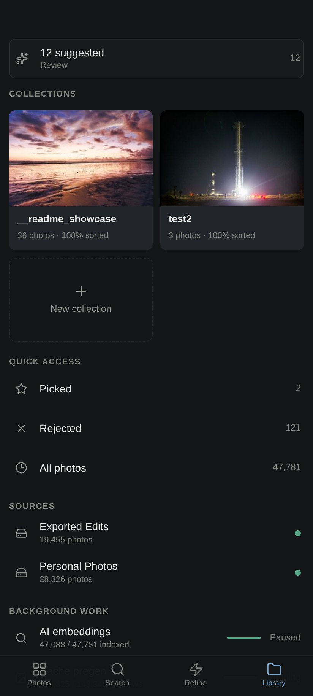

# photoArchive

**Your own photo cloud — with Lightroom Classic instincts.**

photoArchive is a self-hosted library for serious photo archives — and it is **fast**. Where Lightroom chugs, photoArchive flies: browse terabytes of photos at lightning speed from your own computer, NAS, or server. Cull, rank, search, and share tens of thousands of images without uploading a single byte to anyone else's cloud.

It runs on your own hardware. Your files never move, never get edited, never leave your network unless you explicitly share them.

## Built for speed

- **A tiered preview cache** (small / medium / large / originals) with configurable size budgets pre-generates in the background, so browsing never waits on a slow external drive.
- **An in-memory hot cache** serves the thumbnails you're actually looking at from RAM.
- **A virtualized grid** keeps the DOM tiny no matter how deep you scroll — 50,000 photos feel like 50.
- **Response caching** on every heavy query means filters, counts, and date histograms come back instantly.

Point it at terabytes on a sleepy USB drive and it still feels instant — the archive wakes the drive only when it truly needs original pixels.


## Why it exists

Google Photos is effortless but owns your library. Lightroom Classic is powerful but heavy, subscription-bound, and was never built to be your archive's home. photoArchive takes the best instincts of both:

- **From Google Photos** — instant timeline, semantic search ("sunset over water"), face grouping, an installable phone app, shareable links.
- **From Lightroom Classic** — a real folder tree, pick/reject culling, stacks, a keyboard-first loupe, filters that compose, and density you can feel.
- **From neither** — Elo photo ranking. Instead of guessing star ratings, you make quick this-or-that picks and the archive *learns* which photos are your best, propagating results through visually similar images.

## The library

A virtualized grid that stays smooth at 50,000 photos. Real folder tree with per-folder counts and instant scoping. Filter by camera, lens, file type, flag, rating floor, date — every facet composes. A timeline scrubber rides the right edge for date-sorted views. Zero-result scopes tell you *why* and offer the fix.

**Stacks** group what belongs together, LR Classic-style: burst sequences, export variants of one edit, and cross-source duplicates (that Facebook re-upload of your original) are auto-detected by three builders and collapse behind a single cover with a count badge. Expand in place, promote a new cover, or resolve a whole stack with one action.

**Trash is safe by design.** Deleting moves files to a `.trash` area on the same drive — fully restorable, byte-identical, with ratings and history intact. Nothing is permanently deleted until you empty the trash yourself.

## The loupe


A full canvas view, not a modal: metadata, Elo ranking, and a live histogram stay alongside the image. Zoom to 100% with Space, flag with P/X/U, cycle the info overlay with I, and press **L** for lights-out when it's just you and the photograph.


## Ranking, not rating


**Refine** shows you a mosaic — pick the best one. The winner is replaced with a fresh contender; the rest stay and keep competing. Behind it: an Elo system with uncertainty tracking, propagation through visually similar photos, and selectable strategies (Diverse, Explore, Compete). A quality meter tells you how *sorted* any scope is. Rank your whole archive, one two-second decision at a time.

## Search that actually understands

Three engines answer every query and their results are fused:

1. **Metadata** — filenames, folders, cameras, lenses, dates (trigram FTS).
2. **Semantic embeddings** — a local vision model (Qwen3-VL 8B) indexes every photo on your own GPU; "night sky over trees" just works.
3. **VLM captions** — a local vision-language model writes a rich description and tags for each photo into a full-text understanding index.

Reciprocal-rank fusion + reranking combine all three, and the omnibox shows live photo results, facet completions (`camera:`, `lens:`, `folder:`…), and natural date parsing as you type. All models run locally — search quality is measured by a built-in eval harness, not vibes.

## People, privately

Local face detection (InsightFace) clusters faces into people entirely on your machine. Name them, merge duplicates, filter any view by who's in the frame. No cloud, no face data leaving your network — the workers only ever read the app's own cached previews, never your originals.

## Sharing that beats a Google Photos link

Share any collection as a private gallery link:

- **Password protection** with proper key-derivation hashing and signed cookies.
- **View analytics** — know when and how often a client opened the gallery.
- **Client proofing** — recipients favorite photos in the gallery; their picks flow back into your archive as flags, ready for export.
- Public links serve resized previews only — originals never leave the archive.

Zip export of any filtered view (originals or previews) with symlink-safe path hardening, size budgets, and manifest reporting.

## The phone app



An installable PWA at `/m`: fast timeline with pinch density, pull-to-refresh, one-handed bottom action bars, haptics, offline-aware states, and an Android Back button that closes layers the way a native app would. Collections, search, refine duels, and people — all on your phone, over your own network (Tailscale pairs beautifully).

## Architecture

- **Backend**: FastAPI + SQLite (WAL). Feature-sliced modules with dependency-injected routes, additive-only schema migrations, and a contract-tested public API surface (380+ tests).
- **Frontend**: browser-native ES modules. No bundler, no build step, no framework — the desktop app is plain modern JavaScript with a virtualized grid.
- **Workers**: thumbnail pregeneration, embedding indexer, face scanner, and VLM captioner run as idle-gated background jobs that share a single GPU sequentially and never touch source files — they read the app's own preview cache.
- **Local-first**: the catalog, caches, and models all live beside the app. Offline drives degrade gracefully; cached views keep working and rescans wait for the drive to return.

## Quickstart

```bash
git clone https://github.com/Sean-Kenneth-Doherty/photo-archive.git
cd photo-archive/web
python -m venv .venv && .venv/bin/pip install -r requirements.txt
.venv/bin/uvicorn app:app --host 0.0.0.0 --port 8000
```

Open `http://localhost:8000`, add a source folder in the system drawer, and let the scanners run. AI features (semantic search, captions, faces) activate when you install the local models from Background Work — everything works without them, and gets smarter with them.

## Docs

- [Features in depth](docs/features.md)
- [Development guide](docs/development.md)
- [Background work & AI model behavior](docs/background-work-behavior.md)
- [Data & privacy](docs/data-and-privacy.md)

---

*photoArchive is developed against the author's own 47,000-photo working archive — every screenshot above is that real library running on a single machine with an RTX 2060 Super. Your photos are your own; the app ships empty and hungry.*
